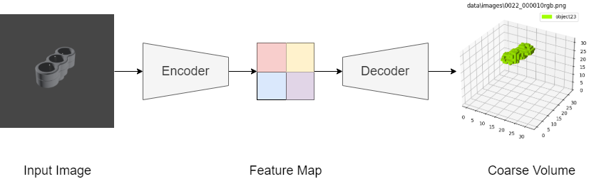

# 3D Reconstruction Using Image, Depth and Normal Maps



## Datasets

I used the blender API to generate a synthetic dataset based on the [T-LESS](http://cmp.felk.cvut.cz/t-less/) dataset.

- [blenderRenderer](https://github.com/onorabil/blenderRenderer)
- [resources](https://drive.google.com/drive/folders/1IlFDUHxvjXrwdo9GdHM764n9HKwnzfml)

## Pretrained Model

Pretrained models are available in the latest [release](https://github.com/alexjercan/mesh-pose-reconstruction/releases/tag/v1.0)

## Prerequisites

### Clone the Code Repository

```shell
git clone https://github.com/alexjercan/mesh-pose-reconstruction.git
```

### Install Python Denpendencies

```
cd mesh-pose-reconstruction
pip install -r requirements.txt
```

### Update Settings in `config.py`

Default configuration is available [here](./config.py).

```python
DEVICE = "cuda" if torch.cuda.is_available() else "cpu"

# Dataset Configuration
DATASET = 'bdataset'
USED_LAYERS = [L_RGB, L_DEPTH, L_NORMAL]
IMG_DIR = "../" + DATASET + "/images/"
MESH_DIR = "../" + DATASET + "/labels/"
NUM_WORKERS = 4
BATCH_SIZE = 4
IMAGE_SIZE = 224
MAP_SIZE = 32
NUM_CLASSES = 30
PIN_MEMORY = True
AUGMENT = False

# Model Configuration
ENCODER_LEARNING_RATE = 1e-3
DECODER_LEARNING_RATE = 1e-3
ENCODER_LR_MILESTONES = [150]
DECODER_LR_MILESTONES = [150]
BETAS = (.9, .999)
GAMMA = .5
WEIGHT_DECAY = 1e-4

# Train Configuration
NUM_EPOCHS = 35
TEST = True

# Test/Detect Configuration
DETECT_PATH = "./data/images"
VOXEL_THRESH = 0.3
PLOT = False

# Checpoint Configuration
LOAD_MODEL = True
SAVE_MODEL = True
CHECKPOINT_FILE = "normal.pth"

# Classes
NAMES = ['object01', 'object02', 'object03', 'object04', 'object05', 'object06', 'object07', 'object08', 'object09', 'object10',
         'object11', 'object12', 'object13', 'object14', 'object15', 'object16', 'object17', 'object18', 'object19', 'object20',
         'object21', 'object22', 'object23', 'object24', 'object25', 'object26', 'object27', 'object28', 'object29', 'object30']
```

## Get Started

To train the model, you can simply use the following command:

```
python3 train.py
```

To test the model, you can simply use the following command:

```
python3 test.py
```

To view reconstruction result, you can run:

```
python3 detect.py
```

## Environments

- **Google Colab** notebooks with free GPU: <a href="https://colab.research.google.com/github/alexjercan/mesh-pose-reconstruction/blob/master/tutorial.ipynb">

